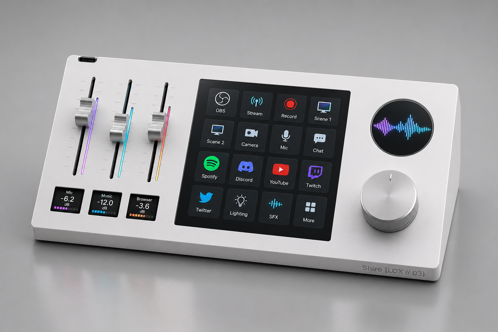
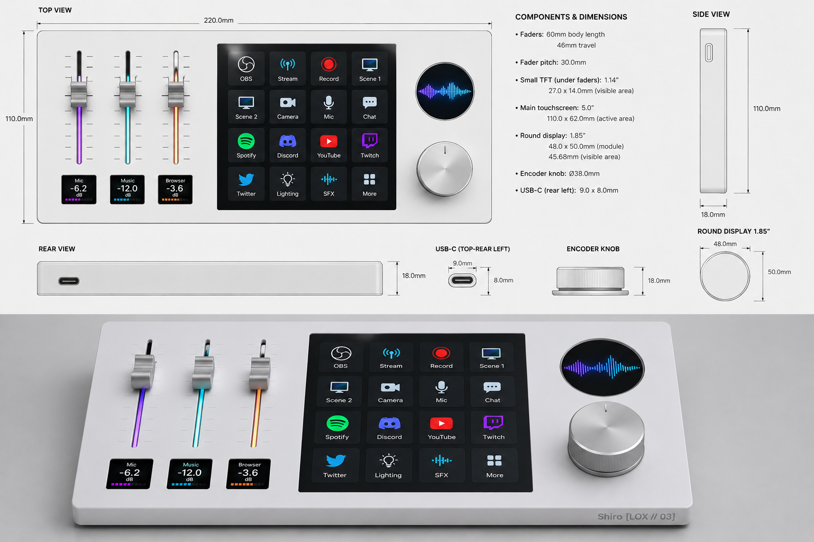

# Shiro [LOX // 04]

> DIY Stream Deck + Audio Mixer — Custom desktop controller built from scratch


---

## What is Shiro ?

Shiro [LOX // 04] is a fully custom desktop audio/stream controller — a single unique unit combining a **Stream Deck**, a **hardware audio mixer**, and a **Bluetooth receiver** into one clean white enclosure.

Built for a streaming and gaming setup, it replaces both a software mixer and a Stream Deck with a single physical device that sits on the desk and does everything.

---

## Features

- **3 assignable faders** — control any Windows audio source (Discord, Spotify, game, browser...) reassignable on the fly
- **Bluetooth A2DP** — receive audio from iPhone or any BT device, mixed directly into the hardware chain
- **Stream Deck** — 5" touchscreen with configurable shortcut grid (OBS scenes, apps, macros...)
- **Hardware master volume** — rotary encoder driving a PT2258 digital potentiometer via I2C
- **Active audio mixing** — NE5532 op-amp mixer combining BT and PC audio sources
- **2.1 amplifier output** — TPA3116D2 driving 2 satellites + 1 subwoofer with hardware crossover
- **VU meters** — WS2812B RGB LED strips alongside each fader, driven in real time
- **Per-fader mini screens** — 0.96" TFT displays showing assigned source and level
- **Ambient screen** — 1.85" round TFT showing a custom gif at rest, switching to volume/EQ info on encoder touch
- **Auto BT fader assignment** — when a BT device connects, a fader is automatically assigned to control its volume

---

## Hardware Architecture

```
┌─────────────────────────────────────────────────────┐
│                   SHIRO [LOX // 04]                 │
│                                                     │
│  ┌──────────┐   ┌──────────────────────────────┐   │
│  │  RP2040  │   │          ESP32-S3            │   │
│  │          │   │                              │   │
│  │ 3 faders │◄──┤ UI / LVGL / BT A2DP         │   │
│  │ WS2812B  │   │ PT2258 I2C / USB HID         │   │
│  │ VU meter │   │ Écran 5" + écran rond 1.85"  │   │
│  └──────────┘   └──────────────────────────────┘   │
│                              │                      │
│         ┌────────────────────┤                      │
│         ▼                    ▼                      │
│  ┌────────────┐     ┌──────────────┐               │
│  │  M-Track   │     │  PCM5102A    │               │
│  │  Duo       │     │  DAC (BT)    │               │
│  │  (PC)      │     │              │               │
│  └─────┬──────┘     └──────┬───────┘               │
│        │                   │                       │
│        └────────┬──────────┘                       │
│                 ▼                                   │
│          ┌────────────┐                            │
│          │   NE5532   │  Active mixer              │
│          └─────┬──────┘                            │
│                ▼                                   │
│          ┌────────────┐                            │
│          │   PT2258   │  Master volume (I2C)       │
│          └─────┬──────┘                            │
│                ▼                                   │
│          ┌────────────┐                            │
│          │  TPA3116   │  Ampli 2.1                 │
│          └─────┬──────┘                            │
│                │                                   │
│        ┌───────┴────────┐                          │
│        ▼                ▼                          │
│   2x satellites      Subwoofer                     │
│   (150Hz HP)         (150Hz LP)                    │
└─────────────────────────────────────────────────────┘
```

---

## Audio Signal Chain

| Source | Path | Control |
|--------|------|---------|
| iPhone / BT device | ESP32-S3 A2DP → I2S → PCM5102A DAC → NE5532 | Fader auto-assigné |
| PC Windows | M-Track Duo → Line Out → NE5532 | Faders 1/2/3 (app PC) |
| Master output | NE5532 → PT2258 → TPA3116 2.1 | Encodeur rotatif |

---

## Components

### Commande 1 — Tests prioritaires (~20€)
| Composant | Référence | Role |
|-----------|-----------|------|
| ESP32-S3 | ESP32-S3-DevKitC-1 (N16R8) | Cerveau principal |
| PCM5102A | PCM5102A DAC Module I2S | DAC Bluetooth |
| PT2258 | PT2258 I2C Volume Control 6ch | Volume master |
| Encodeur | EC11 Rotary Encoder with push | Contrôle PT2258 |
| M-Track Duo | M-Audio M-Track Duo | Interface audio PC (déjà possédé) |
| NE5532 | NE5532 DIP8 + résistances | Mixeur actif |

### Commande 2 — Projet complet (~80€)
| Composant | Référence | Role |
|-----------|-----------|------|
| RP2040 | Raspberry Pi Pico | Faders ADC + LEDs |
| Écran 5" | 5inch HDMI LCD 800x480 Touch | Stream Deck central |
| Écran rond 1.85" | GC9A01 Round TFT SPI | Volume / gif ambiant |
| Mini écrans x3 | 0.96" TFT ST7735 SPI | Affichage par fader |
| Faders x3 | Bourns PTA4543 60mm 10K | Contrôle volumes |
| Ampli 2.1 | TPA3116D2 2.1 Board | Amplification finale |
| Crossover | Active Crossover Filter 150Hz | Séparation sub |
| LEDs | WS2812B Strip 60LED/m | VU mètres |

---

## Repository Structure

```
shiro-lox04/
├── README.md
├── docs/
│   └── Shiro_LOX04_Projet.docx     # Document de projet complet
├── firmware/
│   ├── esp32-s3/                    # Firmware ESP32-S3 (Arduino/IDF)
│   │   ├── src/
│   │   └── platformio.ini
│   └── rp2040/                      # Firmware RP2040
│       ├── src/
│       └── platformio.ini
├── hardware/
│   ├── schematic/                   # Schémas KiCad
│   └── pcb/                         # Fichiers PCB JLCPCB
├── software/
│   └── pc-app/                      # Application Windows (Python / Electron)
└── assets/
    └── renders/                     # Mockups et rendus 3D
```

---

## Development Phases

### Phase 1 — Validation hardware (en cours)
- [ ] TEST 1 : ESP32-S3 → I2S → PCM5102A (BT audio chain)
- [ ] TEST 2 : PT2258 + encodeur (master volume I2C)
- [ ] TEST 3 : M-Track Duo Line Out → NE5532 (PC audio + mixing)

### Phase 2 — Firmware & Software
- [ ] BT A2DP sur ESP32-S3
- [ ] UI LVGL écran tactile 5"
- [ ] Lecture faders ADC sur RP2040
- [ ] Application PC (volumes Windows + auto-assignation BT)

### Phase 3 — Intégration finale
- [ ] PCB custom (JLCPCB)
- [ ] Boîtier (impression 3D / alu)
- [ ] VU mètres WS2812B
- [ ] Sérigraphie Shiro [LOX // 04]

---

## Tech Stack

| Layer | Technology |
|-------|-----------|
| Firmware ESP32-S3 | Arduino / ESP-IDF — LVGL, BT A2DP, I2C |
| Firmware RP2040 | Arduino / MicroPython |
| UI embarquée | LVGL 9.x |
| Application PC | Python (PyAudio + pycaw) ou Electron |
| PCB | KiCad → JLCPCB |
| Boîtier | Fusion 360 → impression 3D / découpe laser |

---

## Author

**Loxehes** — [github.com/Loxehes](https://github.com/Loxehes)

>


